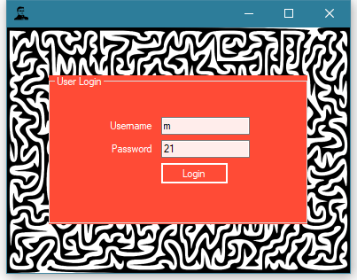
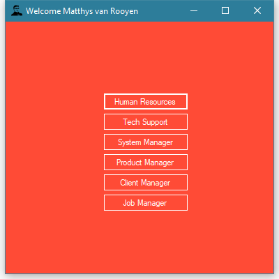
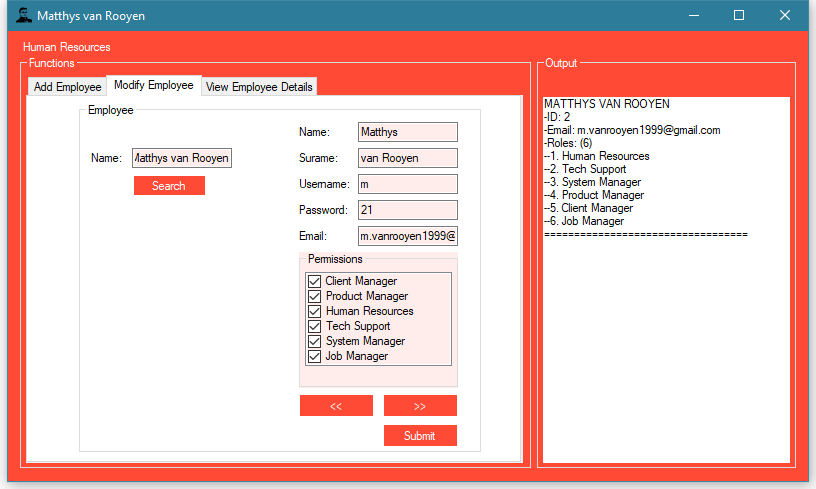
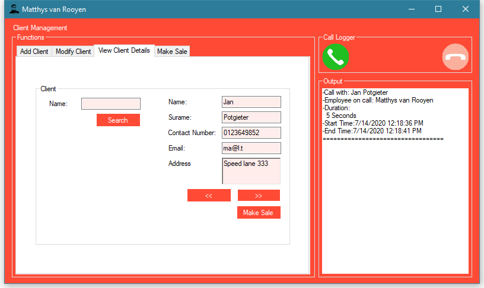
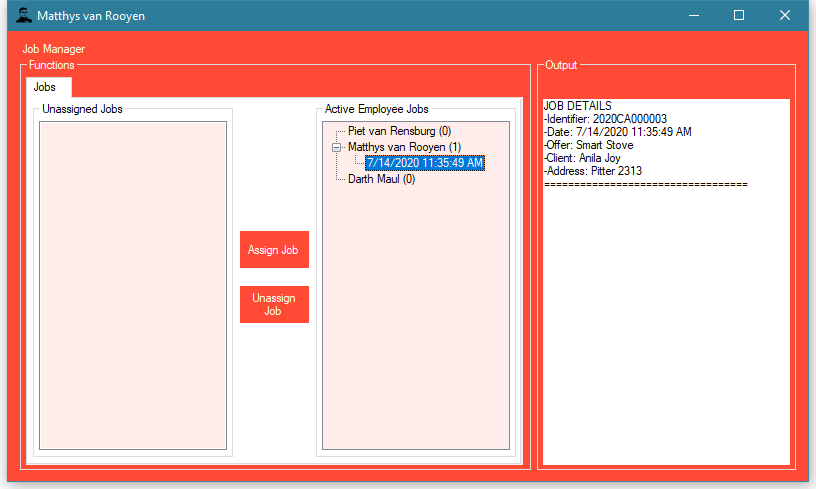
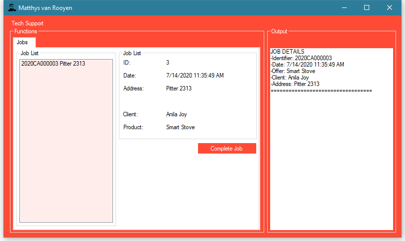
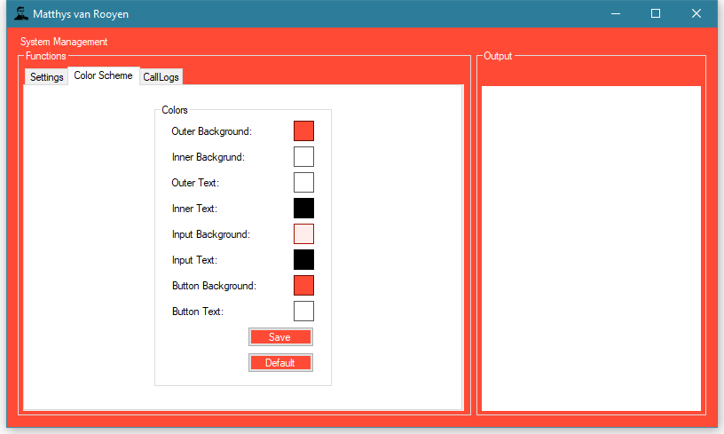

# SEN381 Project

# Details

- Participants: Matthys(self)

This project represents the accumulation of the work and experience that I have acquired through university up to the point of submission.
I was required to plan, design, develop and document the process of developing a system as we would have done in practice.

Key elements of this system includes: Access Management, Employee Management, Client Management, and Product Management.

With features expanding to the sale and management of the installation of products as well as call logging of interactions between employees and clients.

And some of my own innovative implementations includes the interface color manager and the management of employees with permission to access multiple parts of the system.

The process followed to reach the final product included the drawing of UML, Database and Time management diagrams, analyzing user stories and use cases, revising and testing as well as the adding of additional requirements a late stage of the project.

# Images
<figure markdown>
  { width="300" }
  <figcaption>Login</figcaption>
</figure>

<figure markdown>
  { width="300" }
  <figcaption>Hub</figcaption>
</figure>

<figure markdown>
  { width="600" }
  <figcaption>Human Resources</figcaption>
</figure>

<figure markdown>
  { width="600" }
  <figcaption>Client Management</figcaption>
</figure>

<figure markdown>
  { width="600" }
  <figcaption>Job Management</figcaption>
</figure>

<figure markdown>
  { width="600" }
  <figcaption>Tech Support</figcaption>
</figure>

<figure markdown>
  { width="600" }
  <figcaption>System Management</figcaption>
</figure>